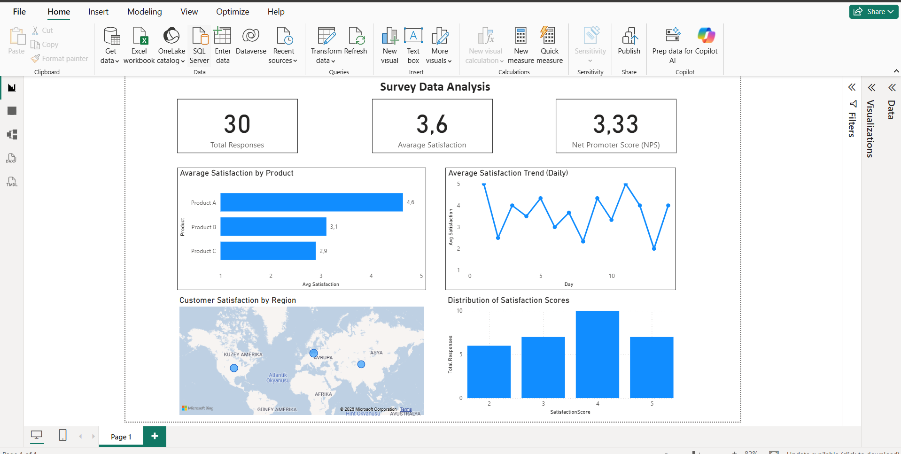

# Survey Data Analysis – Power BI Dashboard

## 📊 Project Overview
This project is an interactive Power BI dashboard built to analyze customer survey data.
It focuses on satisfaction levels, trends over time, regional insights, and Net Promoter Score (NPS).

## 🔍 Key Insights
- Total survey responses and average satisfaction
- Satisfaction trends over time
- Customer satisfaction by product
- Regional satisfaction analysis using map visualization
- Distribution of satisfaction scores
- Net Promoter Score (NPS)

## 🛠 Tech Stack
- Microsoft Power BI
- DAX
- Data Modeling
- Data Visualization

## 📁 Dataset
The dataset contains survey responses including:
- Product
- Satisfaction Score
- Date
- Region

*(Sample dataset included in the repository)*

## 📈 Dashboard Preview

## 🚀 Use Case
This dashboard can be used by:
- Product teams to monitor customer satisfaction
- Management for decision-making
- Analysts for trend and performance analysis
